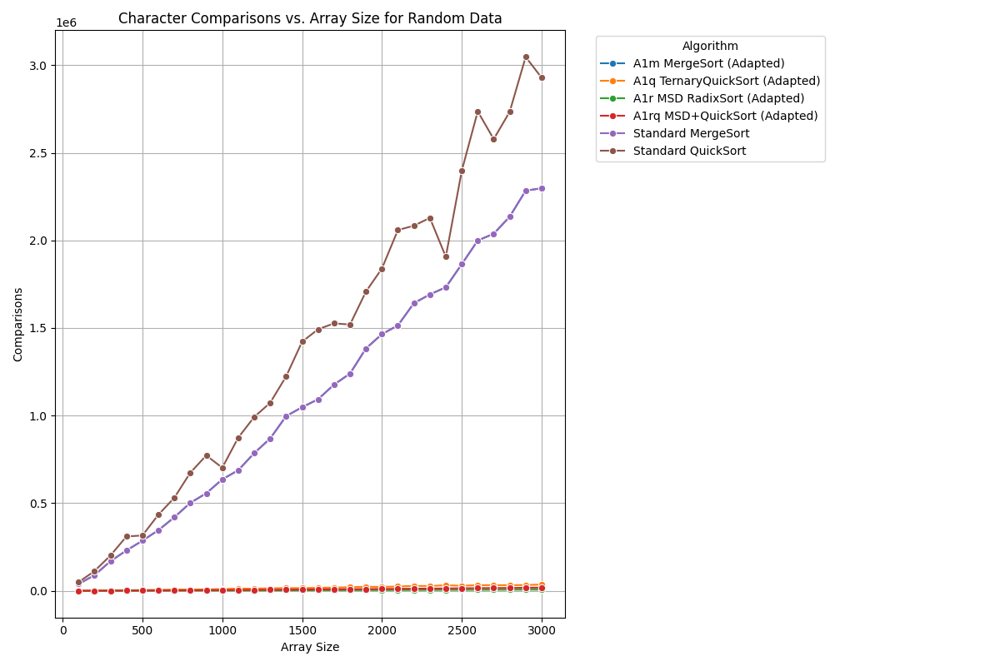

# Блок А

## Репозиторий

https://github.com/trofimpetyanov/ADS-SET9.git

## ID посылок на Codeforces

*   **A1m (Строковая сортировка слиянием):** `321290790`
*   **A1q (Трехпутевая быстрая сортировка строк):** `321291088`
*   **A1r (Поразрядная MSD сортировка):** `321291272`
*   **A1rq (Поразрядная MSD сортировка + Quick Sort):** `321292580`

## Описание

Анализ и сравнение производительности стандартных и адаптированных алгоритмов сортировки массивов строк. Все алгоритмы реализованы на языке C++.

**Тестируемые алгоритмы:**

*   **Стандартные алгоритмы:**
    *   Быстрая сортировка (Quicksort)
    *   Сортировка слиянием (Mergesort)
*   **Адаптированные строковые алгоритмы:**
    *   Трехпутевая быстрая сортировка строк (Ternary String Quicksort, A1q)
    *   Поразрядная MSD сортировка без переключения (MSD Radix Sort, A1r)
    *   Поразрядная MSD сортировка с переключением на QuickSort (MSD Radix Sort + QuickSort, A1rq) при размере подмассива менее 74 (мощность алфавита).
    *   Строковая сортировка слиянием (String Mergesort, A1m).

**Генерация тестовых данных:**

Для экспериментов использовался класс `StringGenerator`, генерирующий строки следующими параметрами:
*   **Набор символов:** 74 символа (заглавные и строчные латинские буквы, цифры, спецсимволы: `!@#%:;^&*()-`).
*   **Длина строк:** от 10 до 200 символов.
*   **Размеры массивов:** от 100 до 3000 строк с шагом 100.
*   **Типы данных:**
    *   Случайные строки.
    *   Обратно-отсортированные строки.
    *   Почти отсортированные строки.
    *   Строки с общими префиксами.

**Измеряемые показатели:**
*   Время выполнения алгоритмов (в миллисекундах).
*   Количество посимвольных сравнений.

**Примечание о выборе опорного элемента в QuickSort:**
При реализации стандартной быстрой сортировки в качестве опорного элемента использовался последний элемент подмассива. В трехпутевой быстрой сортировке строк (A1q) для разбиения использовался первый символ текущего диапазона строк.

## Результаты экспериментов

### 1. Случайные данные

**Время выполнения в зависимости от размера массива (случайные данные):**

- Трехпутевая быстрая сортировка (A1q) и стандартная быстрая сортировка стабильно показывают лучшую производительность для случайных данных при всех размерах массивов, причем A1q часто оказывается немного быстрее.
- MSD поразрядная сортировка (A1r) и ее вариант с отсечкой на QuickSort (A1rq) идут следующими, в целом превосходя варианты сортировки слиянием.
- Стандартная сортировка слиянием и A1m (адаптированная сортировка слиянием) показывают схожее, более высокое время выполнения, масштабируясь примерно линейно с размером массива.

**Количество посимвольных сравнений в зависимости от размера массива (случайные данные):**

- MSD поразрядная сортировка (A1r) выполняет наименьшее количество посимвольных сравнений (ожидаемо, она проверяет символы поразрядно, а не сравнивает строки целиком).
- A1rq (MSD с отсечкой) из-за QuickSort выполняет больше сравнений, чем чистая A1r, но меньше, чем сортировки на сравнениях.
- Трехпутевая быстрая сортировка (A1q), выполняет очень малое количество посимвольных сравнений, сравнимое с MSD-сортировками. Стандартная быстрая сортировка выполняет больше сравнений, чем A1q, но меньше, чем сортировки слиянием.
- Варианты сортировки слиянием (A1m и стандартная) выполняют достаточно большое количество сравнений, что соответствует их поведению O(N log N) по количеству сравнений.

### 2. Обратно-отсортированные данные

**Время выполнения в зависимости от размера массива (обратно-отсортированные данные):**

- Стандартная быстрая сортировка демонстрирует свое худшее поведение O(N^2).
- Трехпутевая быстрая сортировка (A1q) обрабатывает обратно-отсортированные данные намного лучше, чем стандартная быстрая сортировка, и остается очень конкурентоспособной, часто самой быстрой.
- MSD поразрядная сортировка (A1r и A1rq) также показывают хорошие результаты, обычно быстрее, чем сортировки слиянием.
- Варианты сортировки слиянием (A1m и стандартная) сохраняют свою производительность O(N log N) и стабильны.

**Количество посимвольных сравнений в зависимости от размера массива (обратно-отсортированные данные):**

- Стандартная быстрая сортировка показывает огромное количество посимвольных сравнений, подтверждая свой худший сценарий.
- Трехпутевая быстрая сортировка (A1q) выполняет большое количество сравнений, больше, чем на случайных данных, но ее временная производительность все еще хороша благодаря эффективному разделению.
- MSD поразрядная сортировка (A1r) снова показывает наименьшее количество посимвольных сравнений.
- A1rq немного выше A1r по количеству сравнений.
- Варианты сортировки слиянием показывают согласованное количество сравнений, меньшее, чем у вариантов быстрой сортировки в этом худшем для них сценарии.

### 3. Почти отсортированные данные

**Время выполнения в зависимости от размера массива (почти отсортированные данные):**

- Стандартная быстрая сортировка в целом показывает хорошую скорость на почти отсортированных данных, но показывает нестабильность и пики времени выполнения при некоторых размерах массива. Трехпутевая быстрая сортировка (A1q) более быстрая.
- Варианты MSD поразрядной сортировки (A1r и A1rq) конкурентоспособны, обычно превосходя сортировки слиянием.
- Сортировки слиянием (A1m и стандартная) стабильны, но обычно медленнее, чем варианты быстрой и поразрядной сортировки для этого типа данных.

**Количество посимвольных сравнений в зависимости от размера массива (почти отсортированные данные):**

- MSD поразрядная сортировка (A1r) снова лидирует с наименьшим количеством посимвольных сравнений.
- A1rq следует за A1r.
- Стандартная быстрая сортировка выполняет значительное и иногда нестабильное количество посимвольных сравнений на почти отсортированных данных.
- Сортировки слиянием выполняют умеренное количество сравнений.

### 4. Данные с общим префиксом

**Время выполнения в зависимости от размера массива (данные с общим префиксом):**

- Трехпутевая быстрая сортировка (A1q) показывает лучшее время выполнения для данных с общими префиксами, так как она эффективно пропускает общие префиксы при сравнении.
- Стандартная быстрая сортировка также работает хорошо, но обычно немного медленнее A1q.
- MSD поразрядная сортировка (A1r и A1rq) показывает хорошие результаты, но может быть медленнее, чем варианты быстрой сортировки, так как ей все равно приходится обрабатывать символы префикса, хотя и поразрядно. A1rq (с отсечкой) часто немного эффективнее чистой A1r.
- Варианты сортировки слиянием (A1m и стандартная) являются самыми медленными для этого типа данных, поскольку они многократно сравнивают полные строки, включая длинные общие префиксы.

**Количество посимвольных сравнений в зависимости от размера массива (данные с общим префиксом):**

- MSD поразрядная сортировка (A1r) снова выполняет наименьшее количество посимвольных сравнений, тк эффективно обрабатывает префиксы.
- A1rq (MSD с отсечкой) следует за A1r, с немного большим количеством сравнений.
- Трехпутевая быстрая сортировка (A1q) выполняет умеренное количество сравнений, ей все же нужно делать сравнения после префикса.
- Стандартная быстрая сортировка выполняет сильно больше сравнений.
- Сортировки слиянием (A1m и стандартная) выполняют наибольшее количество сравнений, так как они не оптимизированы для общих префиксов.

## Выводы

- **Трехпутевая быстрая сортировка строк (A1q)** имеет отличную общую производительность, очень быстрая для случайных, почти отсортированных данных и данных с общими префиксами. Также обрабатывает обратно-отсортированные данные намного лучше, чем стандартная быстрая сортировка. Количество посимвольных сравнений было выше, чем у поразрядных сортировок, но ее временная эффективность часто была на высоком уровне, особенно для данных с общим префиксом.
- **MSD поразрядная сортировка (A1r)** стабильно приводила к наименьшему количеству посимвольных сравнений для всех типов данных, включая данные с общим префиксом. Время ее выполнения было в целом хорошим, особенно для больших N, хотя и не всегда абсолютно самым быстрым.
- **MSD поразрядная сортировка с отсечкой на QuickSort (A1rq)** имеет хороший баланс. Она часто была немного быстрее или сравнима по времени с чистой MSD поразрядной сортировкой. Отсечка кажется полезной, особенно для данных с общим префиксом и почти отсортированных данных.
- **Стандартная быстрая сортировка** была очень быстрой для случайных, почти отсортированных данных и данных с общим префиксом, но значительно страдала на обратно-отсортированных данных (худший случай O(N^2) по времени и сравнениям).
- **Сортировка слиянием (A1m и стандартная)** варианты были наиболее стабильными для различных типов данных (всегда время O(N log N) и количество сравнений), но в целом были медленнее по времени выполнения, чем трехпутевая быстрая сортировка и MSD поразрядные сортировки в большинстве протестированных случаев, особенно на данных с общим префиксом.

Для универсальной сортировки строк, где распределение входных данных неизвестно или разнообразно, **трехпутевая быстрая сортировка строк (A1q)** и **MSD поразрядная сортировка с отсечкой на QuickSort (A1rq)** представляются самыми сильными. A1q особенно выделяется на данных с общими префиксами. Если минимизация посимвольных сравнений имеет первостепенное значение (например, если сравнения чрезвычайно дороги), то выбрать стоит **MSD поразрядную сортировку (A1r)**.

Сравнение с теоретическими сложностями:
- *Сортировка слиянием (A1m, Стандартная):* Теоретически O(N L log N) по времени и сравнениям, где L - средняя длина строки. Эксперименты согласуются, показывая стабильную, но не самую быструю производительность.
- *Быстрая сортировка (Стандартная):* Средний случай O(N L log N), худший O(N^2 L). Эксперименты подтверждают это, особенно резкое падение производительности на обратно-отсортированных данных.
- *Трехпутевая быстрая сортировка (A1q):* Средний случай O(N L_avg), где L_avg - средняя длина несовпадающей части строк. В худшем случае может приближаться к O(N^2) в некоторых случаях, но на практике очень эффективна, особенно для строк с длинными общими префиксами. Эксперименты показывают ее высокую скорость.
- *MSD Radix Sort (A1r, A1rq):* Теоретически O(N * L_max) в худшем случае (все строки разной длины до L_max), но может быть O(N * k) если строки различаются на первых k символах. Эффективна, когда ключи короткие или имеют общие префиксы. Эксперименты показывают наименьшее количество сравнений и хорошую временную производительность. Отсечка в A1rq помогает для малых подмассивов, где накладные расходы MSD могут быть выше.